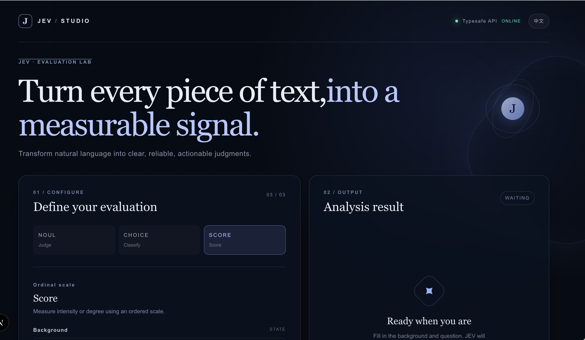
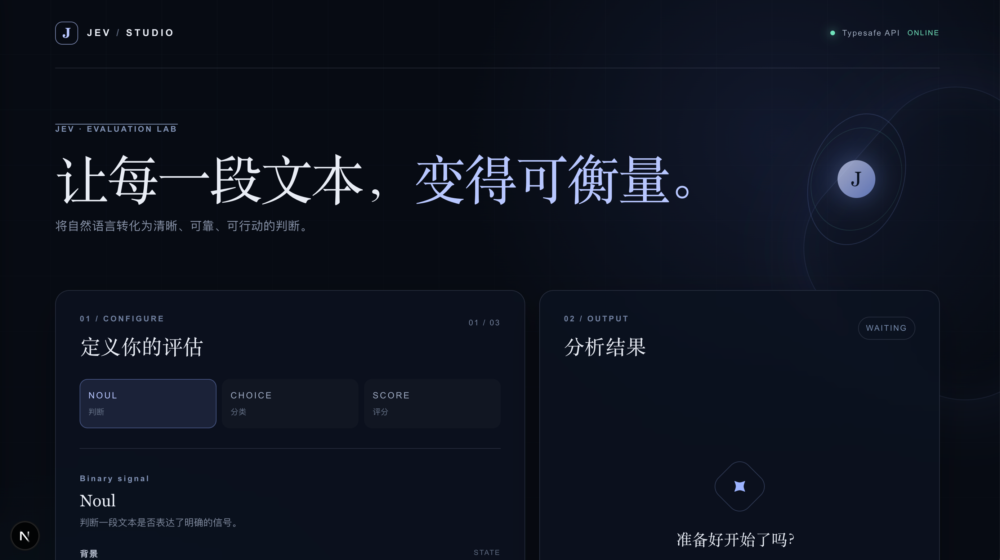
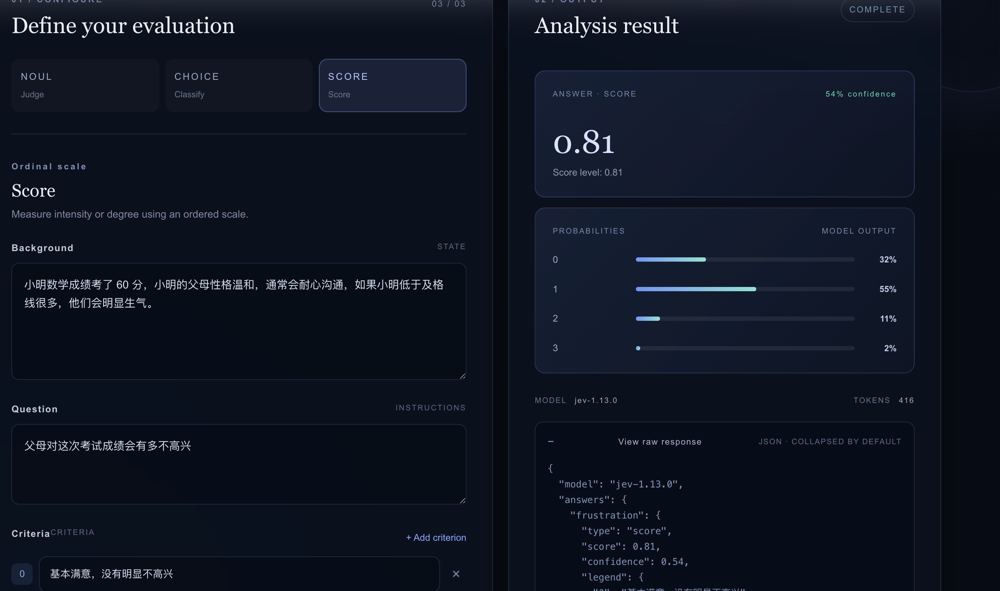

# JEV Studio

[English](./README.md) | 中文

JEV Studio 是一个基于 Next.js 的评估实验台，通过 Typesafe SystemOne API 将自然语言输入转换为结构化信号。

项目提供三种评估模式：

- **Noul** —— 二元信号判断
- **Choice** —— 使用自定义选项进行多分类路由
- **Score** —— 使用自定义等级进行有序评分

三个 tab 共用同一份「背景」内容，但每个 tab 都会独立保存自己的「问题」。当前模式、问题、评估标准、API Key 和语言偏好会通过 `localStorage` 保存在当前浏览器中。

## 预览

英文界面：



中文界面：



示例结果：



## 环境要求

- Node.js 20.9 或更高版本
- pnpm 11（推荐，也可以使用 npm）
- Typesafe API Key

## 开始使用

安装依赖：

```bash
pnpm install
```

创建本地环境变量文件：

```bash
cp .env.example .env
```

在 `.env` 中填写 API Key：

```env
TYPESAFE_API_KEY=your_typesafe_api_key
```

启动开发服务器：

```bash
pnpm dev
```

然后打开 [http://localhost:3000](http://localhost:3000)。

如果服务端没有配置 `TYPESAFE_API_KEY`，页面会显示 API Key 输入框。输入的 Key 只会用于当前请求，并会作为当前浏览器草稿的一部分保存在本地。

## 使用流程

1. 选择 **Noul**、**Choice** 或 **Score**。
2. 填写三个 tab 共用的背景内容。
3. 填写当前 tab 独立的问题。
4. 使用 **Choice** 时，至少添加两个「key / 描述」选项。
5. 使用 **Score** 时，至少添加两个评分等级。
6. 点击 **运行评估** 发起请求。
7. 查看结构化答案、置信度、概率、Token 用量和原始 JSON 报文。

页面右上角的语言按钮可以在英文和中文之间切换。

## API 路由

浏览器不会直接请求 Typesafe，而是调用项目内部的 API 路由：

```text
POST /api/systemone
```

该路由会校验 `state` 和 `questions`，补充服务端 API Key，然后将请求转发到：

```text
https://api.typesafe.ai/v1/systemone
```

当 API Key 配置在 `.env` 中时，它不会被硬编码进客户端代码或浏览器 bundle。

## 常用脚本

```bash
pnpm dev       # 启动开发服务器
pnpm lint      # 执行 ESLint 检查
pnpm build     # 创建生产构建
pnpm start     # 启动生产服务器
```

## 项目结构

```text
app/
  api/systemone/route.ts  # Typesafe API 代理
  globals.css             # 全局样式和响应式布局
  layout.tsx              # 根布局和页面元数据
  page.tsx                # 交互式评估工作台
public/sample/            # README 预览图片
.env.example              # 环境变量模板
```

## 许可证

本项目为私有项目，主要用于演示和内部开发。
